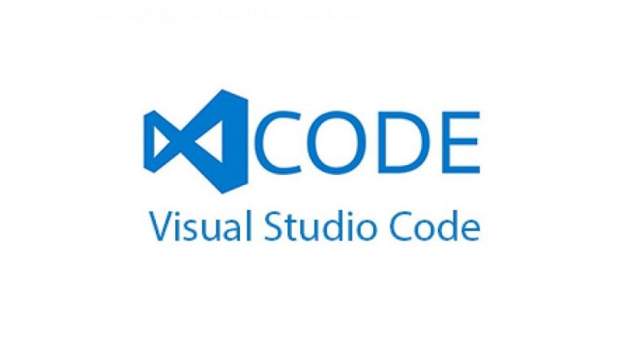

# Введение в контроль версий
## Установка Git и Visual Studio Code
- Установка Git для Windows, MAC, Linux:
> https://git-scm.com/downloads

- Установка Visual Studio Code на Windows, MAC, Linux:

[скачать здесь](https://code.visualstudio.com/Download)

- Введите команду, чтобы проверить, установлен ли Git на вашем устройстве (PowerShell, терминал VSC):
> git --version

- При первом использовании Git вам необходимо представиться. Для этого введите в терминале следующие команды:
> git config --global user.name Your_name

затем
> git config --global user.email your_email@example.com
## Основные команды Git
1. Инициализация локального репозитория (папки, с которой предстоит работать):
> git init

2. Получение информацию от Git о его текущем состоянии:
> git status

3. Добавление файла или файлов к следующему коммиту:
> git add

или
> git add .

для добавления всех файлов.

4. Создание коммита:
> git commit -m “message”

или
> git commit -a -m “message”

для одновременного создания изменения и его коммита.

5. Вывод истории всех коммитов с их хеш-кодами:
> git log

6. Переход от одного коммита к другому:
> git checkout

7. Возвращение в актуальное состояние и продолжение работы:
> git checkout master

8. Разница между текущим и закомиченным файлом:
> git diff
## Работа с ветками
1. Просмотр всех веток в репозитории:
> git branch

2. Создание новой ветки:
> git branch name_branch

3. Переход к другой ветке:
> git checkout name_branch

или
> git checkout -b branch_name

для одновременного создания новой ветки и перехода в нее.

4. Удаление ветки:
> git branch -d  new_branch

5. Журнал коммитов с визуализацией:
> git log --graph

## Работа с удаленным (находящимся в сети интернет) репозиторием
* Клонирование удаленного репозитория на  локальный ПК:
> git clone url-address-репозитория

* Получение изменений и слияние с локальной версией:
> git pull

* Отправка локальной версии репозитория на удаленную:
> git push

## Форматирование текста в Git
* (#) - выделение заголовков. Количество символов “#” задаёт уровень заголовка  (поддерживается 6 уровней):
# Пример
или
###### Пример
* (= or -) - подчёркивание этими символами (не менее 3 подряд) выделяет заголовки  первого (“=”) и второго (“-”) уровней.
* (** ** или __ __ ) - полужирное начертание

**Пример**
* (* *или _ _ ) - Курсив

*Пример*
* (*** ***) - полужирный курсив

***Пример***
* (~~ ~~) - зачеркнутый текст

~~Пример~~
* (* Строка - ненумерованные списки, символ “*” в начале строки
* 1, 2, 3 ... – нумерованный список